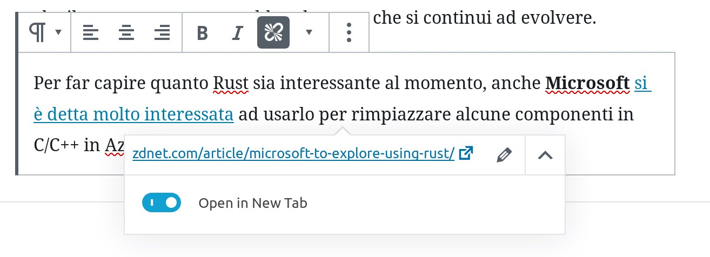

# Mia Mamma Usa Linux

## Regole generali di creazione articoli

Questo vademecum contiene informazioni utili per la stesura di un articolo:

* Per tutti i link esterni al portale selezionate **"Open in new tab"**:
  
* **Eliminare dove possibile l'uso del ";"** (punto e virgola) è anti estetico,
  non lo usa nessuno e soprattutto, non mi piace per nulla. Meglio un bel punto
  con la maiuscola, il punto e virgola ha senso solo per separare le voci di un
  elenco (vedi ad esempio QUESTO elenco).
* **Inserire sempre l'immagine in evidenza**, che generalmente deve corrispondere
  a quella in testa all'articolo.
* **Inserire sempre i tag** che vengono convertiti in hashtag sui vari social.
  Questi possono contenere trattini (es. "open-source") o spazi ("Red Hat");
* Le parole **Kernel** e **Linux** **vanno sempre scritte con l'iniziale
  maiuscola**.
* La parola **open-source** va scritta sempre così negli articoli, non "open
  source" o "OpenSource", semplicemente **open-source**.
* **Quando si riportano citazioni**, ad esempio "Dalle parole di uno dei
  fondatori del progetto, Kevin Hilman:" **va aggiunto obbligatoriamente il link
  di riferimento**.
* **Quando ci sono delle "Quote" in inglese** va inserita la traduzione dove
  solitamente andrebbe la firma ("Add citation").
* È preferibile **utilizzare un dizionario con correttore incluso** che faccia
  highlight delle parole sbagliate, così le review diventano più veloci.
