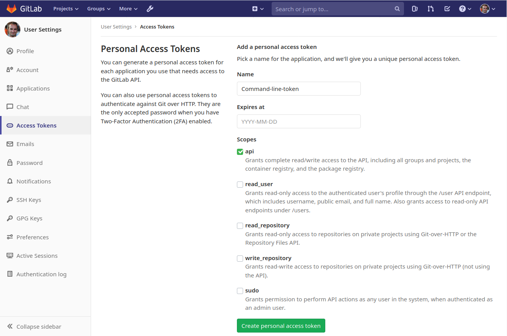

# Use GitLab API from command line via python-gitlab and jq tools

This document describes how it is possible to interact with GitLab from the
command line using the [python-gitlab](https://python-gitlab.readthedocs.io/en/stable/cli.html)
tool and interpreting the **json** output via the [jq](https://stedolan.github.io/jq/)
tool.

## Installing the tools

Supposing that the working dir is **~/Work/GitLab** and you're using Ubuntu,
these are the needed commands to activate the Python virtual environment on
which all the commands will be executed:
```
rasca@catastrofe [~/Work/GitLab]> apt install autoconf libtool python3 python3-virtualenv python-pip3
rasca@catastrofe [~/Work/GitLab]> virtualenv python-gitlab
rasca@catastrofe [~/Work/GitLab]> python-gitlab/bin/activate
(python-gitlab) rasca@catastrofe [~/Work/GitLab]> pip3 install jq python-gitlab
```
As you can see from the last prompt, the environment is correctly loaded.

### Getting a token from GitLab

A token needs to be generated for the personal GitLab user so that all the
calls will inherit the user permissions.
To do this, from the GitLab interface go to "User settings", "Access Tokens" and
then select *api* from the *Scopes*, naming the token whatever you want:


### Checking the supported GitLab API version

Usually the API version is 4, but it is possible to check it with this command:
```
(python-gitlab) rasca@catastrofe [~/Work/GitLab]> curl -k --header "PRIVATE-TOKEN: 3wJxynWmHDfrgii5CfMu" https://gitlab-s1/api/v4/version
{"version":"11.11.1","revision":"ac0d1491ff7"}
```

## Playing with the command line

### Contents of the config file

The python-gitlab installation will end up with a command named *gitlab*
available inside the virtual environment. The command needs a config file to
work correctly, with contents similar to these:
```
[global]
default = mygitlabserver
ssl_verify = true
timeout = 5

[mygitlabserver]
url = https://mygitlab.mydomain
private_token = 3wJxynWmHDfrgii5CfMu
api_version = 4
ssl_verify = false
```
This can be saved in a file named **python-gitlab.cfg** that should be passed
every time the command is invoked:
```
(python-gitlab) rasca@catastrofe [~/Work/GitLab]> gitlab -c python-gitlab.cfg project list
id: 193
path: MyLastRepo

id: 192
path: MyPreviousRepo

id: 191
path: MyPreviousPreviousRepo
...
...
```
it is also possible to create a *~.python-gitlab.cfg* that will be automatically
loaded every time the command gets invoked.

### Using gitlab executable combined with jq

To get the list of all the GitLab repositories (that inside the JSON schema are
named "projects") with the related GitLab project (that inside the JSON schema
is called "namespace"):
```
(python-gitlab) rasca@catastrofe [~/Work/GitLab]> gitlab  -c python-gitlab.cfg -v -o json project list --all | jq -r 'keys[] as $k|sort_by(.id | tonumber) | "\(.[$k] | .id) \(.[$k] | .name) \(.[$k] | .namespace.name )"'
```
To get the list of the projects (namespaces) ordered by amount of repositories
(projects):
```
(python-gitlab) rasca@catastrofe [~/Work/GitLab]> gitlab  -c python-gitlab.cfg -v -o json project list --all | jq -r 'keys[] as $k|sort_by(.namespace.name) | "\(.[$k] | .namespace.name ) \(.[$k] | .id) \(.[$k] | .name)"' | cut -f1 -d" " | sort | uniq -c | sort -k1n
```
To get access level of a project for the master branch:
```
(python-gitlab) rasca@catastrofe [~/Work/GitLab]> gitlab -c python-gitlab.cfg -v project-protected-branch get --project-id 193 --name master
name: master
merge-access-levels: [{'access_level': 30, 'access_level_description': 'Developers + Maintainers'}]
push-access-levels: [{'access_level': 30, 'access_level_description': 'Developers + Maintainers'}]
```
To set the 'Maintainers + Developers' access level for the master branch the
value is 30:
```
(python-gitlab) rasca@catastrofe [~/Work/GitLab]> gitlab -c python-gitlab.cfg -v project-protected-branch create --project-id 193 --name master --push-access-level 30 --merge-access-level 30
```
To get all the repositories (projects) part of the *MyProject* project
(namespace):
```
(python-gitlab) rasca@catastrofe [~/Work/GitLab]> gitlab  -c python-gitlab.cfg -v -o json project list --all | jq -r 'keys[] as $k | "\(.[$k] | .id) \(.[$k] | .name) \(.[$k] | .namespace | select(.name==env.PROJECT) | "" )"'
```
To get all the repositories (projects) part of the MyProject project
(namespace), using an environmental variable:
```
(python-gitlab) rasca@catastrofe [~/Work/GitLab]> export PROJECT="MyProject"
(python-gitlab) rasca@catastrofe [~/Work/GitLab]> gitlab  -c python-gitlab.cfg -v -o json project list --all | jq -r 'keys[] as $k | "\(.[$k] | .id) \(.[$k] | .name) \(.[$k] | .namespace | select(.name==env.PROJECT) | "" )"'
```
It is also possible to use the jq argument *--arg PROJECT "$PROJECT"* to use
directly the $PROJECT variable inside jq.

To massive edit all the repositories (projects) part of the MyProject project (namespace):
```
(python-gitlab) rasca@catastrofe [~/Work/GitLab]> IFS="
"
(python-gitlab) rasca@catastrofe [~/Work/GitLab]> export PROJECT="MyProject"
(python-gitlab) rasca@catastrofe [~/Work/GitLab]> PROJECTLIST=$(gitlab  -c python-gitlab.cfg -v -o json project list --all | jq -r 'keys[] as $k | "\(.[$k] | .id) \(.[$k] | .name) \(.[$k] | .namespace | select(.name==env.PROJECT) | "" )"')
(python-gitlab) rasca@catastrofe [~/Work/GitLab]> for LINE in $PROJECTLIST; do \
	ID=$(echo $LINE | cut -f1 -d" "); \
	PROJECT=$(echo $LINE | cut -f2 -d" "); \
	echo "# $PROJECT ($ID)"; \
	gitlab -c python-gitlab.cfg -v project-protected-branch delete --project-id $ID --name master; \
	gitlab -c python-gitlab.cfg -v project-protected-branch create --project-id $ID --name master --push-access-level 30 --merge-access-level 30; \
	gitlab -c python-gitlab.cfg -v project-protected-branch get --project-id $ID --name master; \
done | tee output
```
